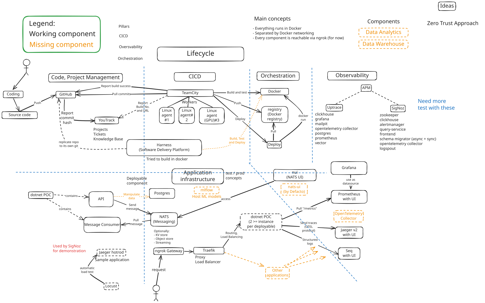

# 
 The MRZ Project 

THIS SITE IS UNDER CONSTRUCTION

## Introduction

Welcome to Zoltan's home project, called MRZ.

**TLDR;** Enabler for developing applications from code to deploy to monitoring with a self-hosted Cloud Native infrastructure
[Component diagram](#main-components)

**NOT TLDR;**

The project aims to create a Cloud Native infrastructure to help developing any software product. It covers the whole DevOps chain from issue tracking, developing, building, deploying, hosting and monitoring. The main purpose is not to create a running application, but enable everything around it. This repository will showcase the current status of the project.

As Cloud Native's definition is not 100% precise, I let a little room for my interpretation as well. Below I define the project criterias an how the project and components selection works.

## Project baseline

### Component criterias

- Self-hosted in any containerization software: I use Docker, but keeping in my Kubernetes orchestration compatibility for later
- Open-source, freemium (free for small teams / non-commercial). Not MUST, but SHOULD be.
- Plus points:
  - Easy of use
  - Ease of setup (docker)
  - Good documentation of the above
  - Great integration with other components, eg. Build Server with Issue Tracking and Git
  - Using standardized approaches
  - Can work in clusters (for scalability)
- Application supporting tools (DB, Messaging, etc.) needs to have a .NET library (as I'm a dotnet dev primarily)

### Components selection process

1. Identify the problem it needs to solve. Eg. building code, deploying code, artifacts host, secrets management, application database or messaging, etc..
2. Try to find a components standalone on <https://cncf.io>, or <https://cd.foundation/> or other means
3. Select one and follow it through it's repository page, deployment instructions.
4. Verify if it is suitable by justifying the "Plus points"
5. Compare multiple tools
6. Proceed to set up a script to self host
7. Experiment with on or more tool (usually one tool, than go to next if not worked)
8. Conclude of success / failure

## Main components

The diagram is heavily outdated, will be reworked for better readability.

- (Almost) Everything is self-hosted Docker: except YouTrack, GitHub, and an ngrok executable

### Code hosting, Project Management, Issue Tracking

- GitHub: For Git repository
- JetBrains YouTrack: Issue Tracking, Issue Boards, Knowledge Base

### CI/CD

- JetBrains TeamCity
  - Build, Test, Code and Deploy (in Docker, to Docker)
  - Hosting NuGet packages
  - 1 server, 3 agents, one with CUDA capability
  - Server uses Postgres for it's data
- [Distribution Registry](https://hub.docker.com/_/registry) for hosting Docker images
- Harness SDLC platform (NOT USED)

### Observability

- Seq: Logging

- Jaeger: Tracing
  - OpenSearch as a Jaeger backend (BEING DECOMISSIONED)
  - ElasticSearch as a Jaeger backend
  - Jaeger Spark jobs for scraping service relation graphs
- Prometheus: Metrics ingesting from many components: Postgres DB, NATS, dotnet hosts and so on
  - Metric collectors
    - cAdvisor: Docker metrics
    - NATS Surveyor: NATS metrics
    - Prometheus NATS Exporter: Alternative metrics collection
    - Prometheus Postgres Exporter: Postgres metrics collector
  - Direct collector
    - dotnet hosts and later further applications
    - Traefik
- Grafana: Visualize metrics (and beyond)
- Fluentd (NOT USED)

I use OpenTelemetry protocol where it's available

#### APM

Only tried two full APM products:

- SigNoz (NOT USED)
- Uptrace (NOT USED)

They are very resource hungry, so they are not used and not experimented with at the moment.
  
### Application Infrastructure components

That applications can use to do their job

- (Relational) Database: Postgres
- Messaging: NATS
  - 3 nodes simple cluster
- Traefik for Routing, Load Balancing
- ngrok for external visibility and unified urls

#### Application Infrastructure _supporting_ components

- Infisical: for secrets and configuration management
- Hashicorp Vault: for secrets and configuration management (NOT USED)
- Mlflow (RUNNING but NOT USED)
  - Postrges as backend
  - MinIO as object storage
- NATS NUI: Browse NATS instances and data
- Defecto NATS UI: Browse NATS instances and data (NOT USED). Not working with the new versions of NATS

## Where it started

Around ~2018, I experimented with TeamCity (also used on the current project I was on) at home to self-host and use multiple agents (3). The project was limited and I didn't invest too much time into it.
I took these small experiments to start the new, but the scope was selected to cover the whole SDLC.

## Reach out

TBD
